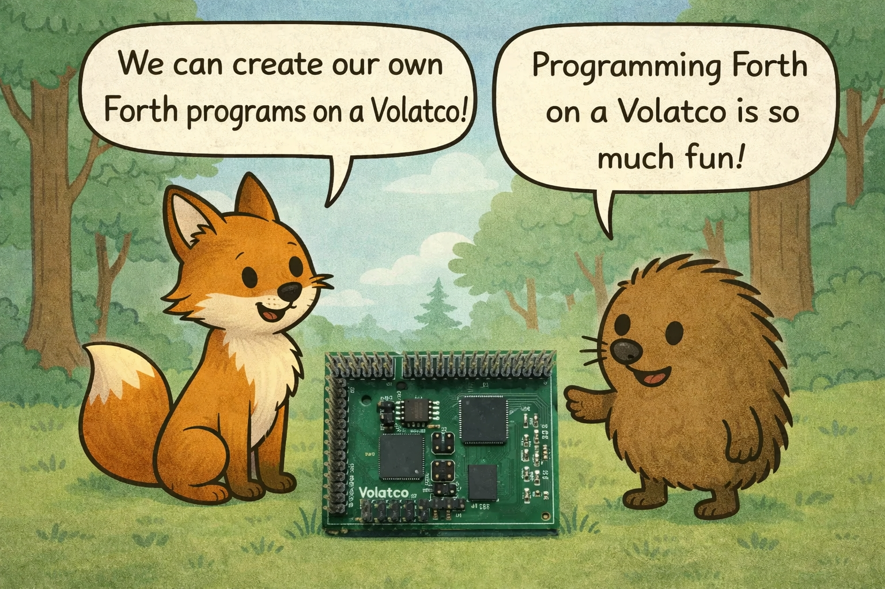

# Forest Creature Adventures

A collaborative comic + animation series where woodland characters explore practical Volatco computing workflows, with a strong focus on reproducible, real-world bring-up steps.

This repository is both:
- A story project (episodes, panel scripts, prompts, visual assets)
- A technical teaching artifact (episodes map to concrete hardware/software milestones)

## Background Story

In a woodland workshop, four friends discover that the only way to bring their ideas to life is to learn real hardware workflows, not just theory. They choose Volatco and Forth as their path, then commit to learning through shared adventures.

The stakes are practical and personal. If they cannot build a reliable foundation, their tools misfire, their tracking and foraging plans fail in the field, and they lose precious daylight fixing avoidable setup mistakes. They also become dependent on outside computing systems that impose opaque rules they cannot interpret or repair on their own. If they succeed, they can create and run real Forth programs together across future episodes, including tools for tracking seasons and time so they can better understand and navigate their place in the universe.

Each character carries part of the journey. Fox leads decisions under uncertainty, Owl translates confusing signals into clear next steps, Hedgehog represents the honest beginner voice, and Squirrel protects repeatability through disciplined setup.

The story arc follows technical maturity: commissioning first, then stable debug habits, then low-power behavior, then long-run reliability. This is why the Pilot Episode begins with Volatco B polyForth bring-up. The team must earn trust in the workflow before they can build bigger programs.

Moral growth is inseparable from technical progress. The group learns that cooperation beats ego, careful communication prevents costly mistakes, and friendship turns frustrating failures into forward motion.

## Value Added

- New collaborators can understand the series purpose, stakes, and sequence in one read.
- Episode 001 is clearly justified as the foundation for all later program-building episodes.
- Character roles now map directly to both technical and moral learning outcomes.

## Why This Repo Exists

We want episodes that are entertaining and technically useful.
The near-term goal is to help readers get from first connection to confidently writing and running Forth programs on Volatco workflows.

## Where To Start

- Project overview: [forest-adventure-series/README.md](/home/cartheur/ame/aiventure/aiventure-github/volatco/forest-creature-adventures/forest-adventure-series/README.md)
- Episode workspace: `forest-adventure-series/episodes/`
- Pilot Episode (primary first episode): [episode-001-volatco-b-j7-polyforth](/home/cartheur/ame/aiventure/aiventure-github/volatco/forest-creature-adventures/forest-adventure-series/episodes/episode-001-volatco-b-j7-polyforth)

## Current Episode Lineup

1. `episode-001-volatco-b-j7-polyforth`
Commissioning episode: establish a repeatable Volatco B polyForth path so later episodes can focus on Forth programs.

2. `episode-002-owl-at-j8`
Serial debug and reset workflow episode around J8/J4 concepts.

3. `episode-003-jezek-quiet-trail`
Low-duty-cycle sensing and wake/sleep behavior episode.

4. `episode-004-hedgehog-night-watch`
Watchdog reliability and recovery behavior episode.

Each episode folder should contain:
- episode YAML
- `script.md`
- `panel-prompts.md`
- `panel-checklist.txt`

## Production Flow (Current)

1. Define episode metadata in YAML.
2. Generate scaffold files:
   - `forest-adventure-series/episodes/generate_episode.py`
3. Generate panel images from prompts.
4. Assemble outputs with:
   - `forest-adventure-series/episodes/build_episode.py`

## Gaps and Collaboration Needs

These are the highest-value contribution areas right now:

1. Panel image production backlog
Episodes have scripts/prompts, but most panel image sets are not generated/committed yet.

2. Prompt quality depth
Generated prompts are now criteria-aligned (stakes, autonomy, season/time, aeonForth), but still need stronger episode-specific scene direction and continuity constraints for final visual quality.

3. Episode script depth consistency
Episode structure is now consistent across 001-004, but Episodes 002-004 still need more command-level technical checkpoints and acceptance signals to match Episode 001 depth.

4. QA and acceptance criteria
We need per-episode "definition of done" checks (story quality + technical correctness + visual continuity).

5. Build/test ergonomics
A simple one-command validation script for scaffold/build checks would reduce onboarding friction for new collaborators.

## Contributor Notes

- Keep episode numbering stable unless explicitly reorganizing sequence.
- Treat episode YAML + script + prompts as a synchronized set.
- Prefer practical, reproducible technical outcomes over abstract jargon in story beats.
- If a workflow is based on external technical repos, cite the expected success signals in the episode script.

## Immediate Next Steps

1. Finalize Episode 001 panel art with consistent technical visual anchors (`VOLATCO-B`, `921600`, monitor command moments, `ok` prompt).
2. Deepen Episode 002-004 scripts from generic template beats into practical teaching narratives.
2. Add command-level checkpoints and concrete success signals to Episodes 002-004, using Episode 001 as the technical rigor baseline.
3. Add lightweight contributor checklist for "ready to render" and "ready to publish" states.
